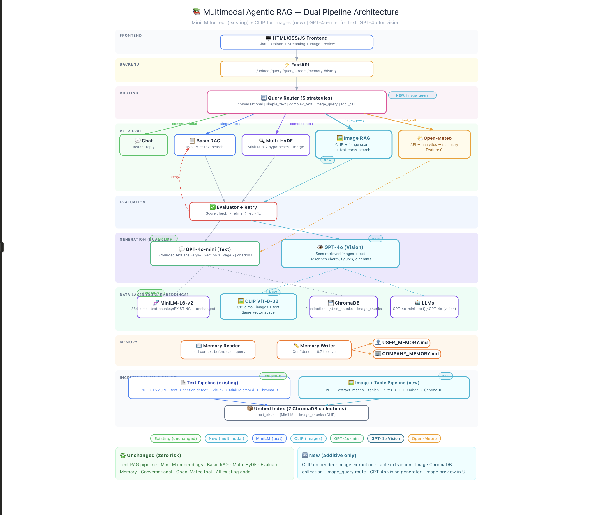

# Architecture Overview

## Goal
Provide a brief, readable overview of how your chatbot works:
An Agentic RAG chatbot that answers questions grounded in uploaded PDF documents with citations, writes selective memory to markdown files, supports conversational interaction, and provides safe external tool execution via Open-Meteo weather analysis.

## Architecture diagram

---

## High-Level Flow

### 1) Ingestion (Upload → Parse → Chunk)
- Supported inputs: PDF files (via PyMuPDF / fitz)
- Parsing approach: PyMuPDF extracts raw text page-by-page with character-level position tracking. Regex-based section detector finds headers matching patterns: Chapter X, Section X.X, numbered headings (1.2 Title), standalone headers (Abstract, Introduction, Methodology, Results, Conclusion, References), and ALL-CAPS headers.
- Chunking strategy: Section-aware. Short sections (< 512 tokens) kept as single chunks. Long sections split at sentence boundaries with 50-token overlap. Each chunk inherits its parent section's metadata.
- Metadata captured per chunk:

- chunk_id — unique identifier (doc_id + section + index)
- doc_id — links all chunks to their source document
- section_number — extracted from header (e.g. "3.2")
- section_title — full header text
- section_type — classified type (introduction, methodology, results, etc.)
- page_number — page where the section starts

### 2) Indexing / Storage
- Vector store choice (FAISS/Chroma/pgvector/etc): ChromaDB (local, persistent)
- Persistence: ChromaDB PersistentClient writes to chroma_db/ directory. Survives server restarts.
- Optional lexical index (BM25): Not implemented. Semantic search handles most cases; Multi-HyDE compensates for vocabulary gap.

### 3) Retrieval + Grounded Answering
- Retrieval method (top-k, filters, reranking):
- conversational — greetings, thanks, help → instant reply, no RAG
- simple — section/page references → Basic RAG (direct embedding search)
- complex — analytical/comparative questions → Multi-HyDE RAG
- tool_call — weather keyword + location detected → Open-Meteo tool

- Basic RAG: Embed query → cosine similarity search in ChromaDB → top-5 results.
- Multi-HyDE RAG:

- GPT-4o-mini generates 2 hypothetical passages (technical or general, based on query type) that would appear in a document answering the question
- Each hypothesis is embedded alongside the original query → 3 separate searches
- All results merged and deduplicated by chunk_id (highest score kept)
- Top-5 unique results returned
- How citations are built:
  - citation includes: Each retrieved chunk carries structured metadata
- Citation format: [Section X, Page Y]
- Citation object includes: source (filename), locator (section + page), snippet (section type + title)
- Low-relevance chunks (similarity score < 0.3) are filtered before generation to prevent false citations
- Failure behavior:
- If all retrieved chunks score below 0.3 → empty citations → response: "I don't have enough information in the provided documents to answer that accurately"
- If no documents are indexed → response: "Upload a PDF first" (no RAG attempted)
- Out-of-context questions (weather, recipes, etc.) naturally score low and get rejected

- Agentic evaluation loop:

- After retrieval, evaluator checks: is top score ≥ 0.5 OR average score ≥ 0.6?
- If insufficient → LLM refines the query → retries once with the rewritten query
- This self-correction is the core agentic behavior

- Conversation history:

- Last 5 Q&A turns maintained in memory
- Passed to generator for follow-up context
- Ambiguous queries ("tell me more about that") enhanced with previous topic

### 4) Memory System (Selective)
- What counts as “high-signal” memory:
- USER: interests, expertise level, research focus, preferences (e.g. "User is interested in deep learning for stock prediction")
- COMPANY: reusable findings from documents (e.g. "CNN models are faster than LSTM but have comparable accuracy")

- What you explicitly do NOT store (PII/secrets/raw transcript):
- Raw conversation transcripts
- Duplicate facts already in memory

- How you decide when to write:
- After each RAG interaction, an LLM evaluates the conversation
- Outputs structured JSON: {should_write, target, summary, confidence}
- Only appends when confidence > 0.7
- Checks existing memory to avoid duplicates

- Format written to:
  - `USER_MEMORY.md` - timestamped bullet points, e.g. - [2025-02-19 14:30] User is interested in deep learning
  - `COMPANY_MEMORY.md` - — timestamped bullet points, e.g. - [2025-02-19 14:32] Ensemble methods improve medical image classification

### 5) Optional: Safe Tooling (Open-Meteo)
- Tool interface shape: - Router detects weather queries requiring BOTH a weather keyword AND a location pattern (e.g. "weather in Tokyo"). Bare keywords without location (e.g. "What about temperature?") route to RAG — no false positives.
- WeatherTool.analyze(city) → geocode → fetch → compute → summarize

- Pipeline:
- Geocode city name → lat/lon via Open-Meteo geocoding API
- Fetch 14-day hourly data (7 past + 7 forecast) — no API key needed
- Sandboxed numpy analytics: rolling 24h averages, anomaly detection (±2σ), volatility (hourly temp changes), wind classification (calm/gusty hours), data completeness checks
- GPT-4o-mini summarizes computed analytics into natural language

- Safety boundaries:
- compute_analytics() is a pure function — takes data in, returns results. No file I/O, no network access, no side effects
- API calls have explicit timeouts (5s geocoding, 10s weather fetch)
- No restricted imports — uses only numpy and requests
- Tool path never touches ChromaDB, documents, or any RAG component
- If geocoding fails → graceful error message
- If API fails → graceful error message

---

## Tradeoffs & Next Steps
- Why this design?
- ChromaDB over PineconeLocal because zero config for judges. No API key needed.
- MiniLM-L6-v2 over mpnet-base-v2Faster embedding. quick latency

- What you would improve with more time:
- Cross-encoder reranker — rerank retrieved chunks by relevance before generation
- LLM-based evaluator — deeper relevance checking (disabled for speed)
- Authentication + multi-user — session isolation for concurrent users