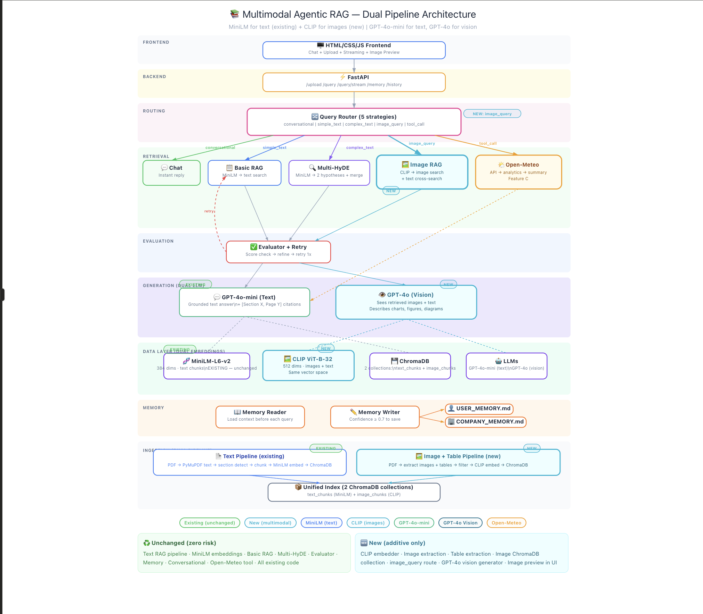

# Agentic RAG Chatbot

An intelligent document Q&A system that combines agentic retrieval with multimodal understanding. Upload any PDF = research papers, textbooks, technical reports  and get grounded answers with citations, powered by an adaptive retrieval pipeline that routes between Basic RAG, Multi-HyDE, and CLIP-based image search.



---

## Video Walkthrough

https://drive.google.com/file/d/1xCL3k6ym-9efe_T14XaQirNXRruPwdUD/view?usp=drivesdk

---

## Features Implemented

### Feature A — File Upload + RAG with Citations (Core)

- **Smart Ingestion:** PyMuPDF extracts text with section detection, sentence-boundary chunking with overlap, and section type classification (introduction, methodology, results, etc.)
- **Dual Retrieval Pipeline:**
  - **Basic RAG** — Metadata filtering (section number, section type) with semantic fallback for simple queries
  - **Multi-HyDE** — Generates multiple hypothetical academic passages, batch-embeds them, searches with all embeddings, and deduplicates for complex analytical queries
- **Intelligent Query Router** — Keyword-first classification (conversational / simple / complex / image_query / tool_call) with LLM fallback
- **Agentic Evaluation Loop** — Checks retrieval quality, refines queries, and retries if results are insufficient
- **Grounded Responses** — Every answer cites sources using [Section X, Page Y] format
- **Multimodal Support** — CLIP-based image extraction and cross-modal search with GPT-4o vision descriptions

### Feature B — Persistent Memory

- **Selective Writing** — LLM-based decision engine evaluates each interaction for memory-worthiness
- **Dual Memory Files:**
  - `USER_MEMORY.md` — User interests, expertise level, research focus, preferences
  - `COMPANY_MEMORY.md` — Reusable document learnings, key findings, domain knowledge
- **Confidence Gating** — Only writes when confidence exceeds threshold
- **No Transcript Dumping** — High-signal facts only, timestamped entries

### Feature C — Safe Tool Calling (Open-Meteo)

- **Weather Analysis Tool** — Calls Open-Meteo API for any location/time range
- **Time Series Analytics** — Rolling averages, volatility, missingness checks, anomaly detection
- **Safe Execution** — Bounded API calls with timeout handling, no arbitrary code execution
- **Natural Language Routing** — Query router detects weather questions and extracts locations automatically

---

## Tech Stack

| Component | Technology |
|---|---|
| LLM | GPT-4o |
| Text Embeddings | sentence-transformers/all-MiniLM-L6-v2 (384d) |
| Image Embeddings | CLIP ViT-B/32 (512d) |
| Vector DB | ChromaDB (local, persistent) |
| Backend | FastAPI |
| Frontend | HTML/CSS/JS (served by FastAPI) |
| PDF Parsing | PyMuPDF (fitz) |
| Table Extraction | Camelot with PyMuPDF fallback |
| Retrieval | Basic RAG + Multi-HyDE + CLIP cross-modal |
| Memory | Markdown files with LLM-gated writes |

---

## Architecture


See `ARCHITECTURE.md`,'Multi_Hyde.png', 'Naive_RAG.png' for the full system design.

---

## Quick Start

```bash
# 1. Clone the repo
git clone https://github.com/Nihal7778/Agentic-AI-RAG-chatbot.git
cd Agentic-AI-RAG-chatbot

# 2. Install dependencies
pip install -r requirements.txt

# 3. Set up environment
cp .env.example .env
# Edit .env → add OPENAI_API_KEY=sk-your-key-here

# 4. Run the app (serves UI at http://localhost:8000)
uvicorn src.main:app --reload --port 8000

# 5. Open in browser
# http://localhost:8000

# 6. Run sanity check
make sanity

# 7. Run evaluation
make eval
```

### Multimodal Support

```bash
# Install CLIP dependencies (for image understanding)
pip install transformers torch Pillow 

# Install table extraction ( better quality)
pip install "camelot-py[base]"
brew install ghostscript  
```

Set `MULTIMODAL_ENABLED = True` in `src/config.py` to activate image search.

---

## Project Structure

```
src/
├── config.py                     # Central configuration
├── main.py                       # FastAPI entry point (serves API + HTML)
├── ingestion/
│   ├── parser.py                 # PyMuPDF text extraction + section detection
│   ├── chunker.py                # Sentence-boundary chunking with overlap
│   └── image_extractor.py        # Image + table extraction from PDFs
├── retrieval/
│   ├── embedder.py               # MiniLM embeddings + ChromaDB (text)
│   ├── clip_embedder.py          # CLIP embeddings + ChromaDB (images)
│   ├── basic_rag.py              # Metadata filter → semantic fallback
│   ├── hyde_rag.py               # Multi-HyDE hypothesis generation + retrieval
│   └── multimodal_rag.py         # Dual pipeline search + GPT-4o vision
├── agents/
│   ├── router.py                 # Query classification (5 strategies)
│   ├── evaluator.py              # Retrieval quality check + query refinement
│   ├── risk_scorer.py            # Section complexity scoring
│   └── orchestrator.py           # Main agent loop
├── generation/
│   └── generator.py              # Grounded response + citations
├── memory/
│   ├── reader.py                 # Reads USER/COMPANY memory
│   └── writer.py                 # LLM-gated selective memory writes
└── tools/
    └── weather.py                # Open-Meteo weather analysis
ui/
├── chat.html                     # Chat frontend
└── style.css                     # Dark theme styling
```

---

## Evaluation Prompts

See `EVAL_QUESTIONS.md` for a full list. Quick examples:

**Simple (Basic RAG):**
- "What does Chapter 3 say?"
- "Show me the introduction"

**Complex (Multi-HyDE):**
- "Compare the performance of CNN and LSTM models"
- "What are the limitations of the proposed approach?"

**Multimodal (CLIP + Vision):**
- "Show me the architecture diagram"
- "Describe the performance chart"

**Weather (Tool Call):**
- "What's the weather in New York?"
- "Analyze temperature trends in London for the past week"

---

## Design Decisions & Tradeoffs

**Why dual retrieval (Basic + HyDE)?** Simple queries like "show me chapter 3" don't need hypothesis generation — metadata filtering is instant. HyDE only activates for analytical questions where bridging the vocabulary gap between user language and academic text matters.

**Why MiniLM + CLIP instead of replacing with CLIP?** MiniLM outperforms CLIP on text-to-text retrieval. CLIP excels at cross-modal (text → image) search. Running both in parallel gives the best of both worlds with independent failure modes.

**Why ChromaDB over Pinecone?** Local persistence, zero setup for judges running `make sanity`, no API keys needed for the vector store.

**Why GPT-4o over GPT-4o-mini?** Unified model for text generation and vision. Simpler routing, better quality, acceptable cost for a portfolio project.

---


